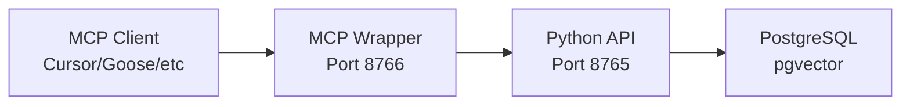

CEMS provides an MCP (Model Context Protocol) wrapper that exposes the Python REST API as MCP tools and resources.

## Architecture

The MCP wrapper is a lightweight Express.js server that:
- Handles MCP Streamable HTTP transport
- Proxies all tool calls to the Python REST API
- Runs stateless (no session management)
- Returns JSON responses (no SSE streaming)



### Services

<CardGroup cols={2}>
  <Card title="cems-server" icon="python">
    Port 8765 - Python REST API (Starlette + uvicorn)
  </Card>
  <Card title="cems-mcp" icon="node-js">
    Port 8766 - MCP wrapper (Express.js + TypeScript)
  </Card>
  <Card title="postgres" icon="database">
    Port 5432 - PostgreSQL with pgvector extension
  </Card>
</CardGroup>

---

## MCP Wrapper Implementation

### Server Setup

```typescript
// From mcp-wrapper/src/index.ts:52
function createMcpServer(authHeaders: { authorization?: string; teamId?: string }) {
  const server = new McpServer({
    name: "cems-mcp-wrapper",
    version: "1.0.0",
  });

  // Helper to get auth headers (always from request, no session caching)
  const getAuthHeaders = () => authHeaders;

  // Register tools and resources...
  return server;
}
```

### Transport Configuration

```typescript
// From mcp-wrapper/src/index.ts:415
const transport = new StreamableHTTPServerTransport({
  sessionIdGenerator: undefined, // Stateless mode - no session tracking
  enableJsonResponse: true,      // JSON response, no SSE streaming
});
```

**Why stateless?**
- Simpler deployment (no session state to manage)
- Works with any HTTP client (no WebSocket/SSE required)
- Auth headers extracted from each request
- No cleanup needed (no sessions to expire)

---

## MCP Tools

The MCP wrapper exposes 6 tools:

### memory_add

Store a memory in personal or shared namespace.

```typescript
// From mcp-wrapper/src/index.ts:62
server.registerTool(
  "memory_add",
  {
    title: "Add Memory",
    description: "Store a memory. Set infer=false for bulk imports (faster).",
    inputSchema: {
      content: z.string().describe("What to remember"),
      scope: z.enum(["personal", "shared"]).default("personal"),
      category: z.string().default("general"),
      tags: z.array(z.string()).default([]),
      infer: z.boolean().default(true).describe("Use LLM for fact extraction"),
      source_ref: z.string().optional().describe("Project reference"),
    },
  },
  async (args) => {
    // Proxy to Python API
  }
);
```

**Usage:**

<CodeGroup>
```typescript TypeScript
await mcpClient.callTool("memory_add", {
  content: "I prefer pytest over unittest for Python testing",
  scope: "personal",
  category: "preference",
  tags: ["python", "testing"],
});
```

```bash cURL
curl -X POST http://localhost:8766/mcp \
  -H "Authorization: Bearer $CEMS_API_KEY" \
  -H "Content-Type: application/json" \
  -d '{
    "jsonrpc": "2.0",
    "method": "tools/call",
    "params": {
      "name": "memory_add",
      "arguments": {
        "content": "I prefer pytest over unittest",
        "scope": "personal"
      }
    },
    "id": 1
  }'
```
</CodeGroup>

### memory_search

Search memories using the full retrieval pipeline.

```typescript
// From mcp-wrapper/src/index.ts:100
server.registerTool(
  "memory_search",
  {
    title: "Search Memories",
    description: "Search using unified 5-stage retrieval pipeline",
    inputSchema: {
      query: z.string().describe("What to search for"),
      scope: z.enum(["personal", "shared", "both"]).default("both"),
      max_results: z.number().default(10).describe("Max results (1-20)"),
      max_tokens: z.number().default(4000).describe("Token budget"),
      enable_graph: z.boolean().default(true),
      enable_query_synthesis: z.boolean().default(true),
      raw: z.boolean().default(false).describe("Debug mode"),
      project: z.string().optional(),
    },
  },
  async (args) => {
    // Proxy to Python API
  }
);
```

**Usage:**

```typescript
const results = await mcpClient.callTool("memory_search", {
  query: "Python testing preferences",
  scope: "personal",
  max_results: 5,
  project: "myorg/myrepo",
});
```

### memory_get

Retrieve full memory document by ID.

```typescript
// From mcp-wrapper/src/index.ts:168
server.registerTool(
  "memory_get",
  {
    title: "Get Memory",
    description: "Retrieve full document by ID (after search returns truncated)",
    inputSchema: {
      memory_id: z.string().describe("ID of memory to retrieve"),
    },
  },
  async (args) => {
    // Proxy to Python API
  }
);
```

### memory_forget

Delete or archive a memory.

```typescript
// From mcp-wrapper/src/index.ts:200
server.registerTool(
  "memory_forget",
  {
    title: "Forget Memory",
    description: "Delete or archive a memory",
    inputSchema: {
      memory_id: z.string().describe("ID of memory to forget"),
      hard_delete: z.boolean().default(false),
    },
  },
  async (args) => {
    // Proxy to Python API
  }
);
```

### memory_update

Update existing memory content.

```typescript
// From mcp-wrapper/src/index.ts:234
server.registerTool(
  "memory_update",
  {
    title: "Update Memory",
    description: "Update an existing memory's content",
    inputSchema: {
      memory_id: z.string().describe("ID of memory to update"),
      content: z.string().describe("New content"),
    },
  },
  async (args) => {
    // Proxy to Python API
  }
);
```

### memory_maintenance

Run maintenance jobs on-demand.

```typescript
// From mcp-wrapper/src/index.ts:266
server.registerTool(
  "memory_maintenance",
  {
    title: "Run Maintenance",
    description: "Run memory maintenance jobs",
    inputSchema: {
      job_type: z.enum(["consolidation", "summarization", "reindex", "all"])
        .default("consolidation"),
    },
  },
  async (args) => {
    // Proxy to Python API
  }
);
```

**Usage:**

```typescript
await mcpClient.callTool("memory_maintenance", {
  job_type: "consolidation"
});
```

---

## MCP Resources

The MCP wrapper exposes 3 resources:

### memory_status

**URI:** `memory://status`  
**Description:** Current status of the memory system

```typescript
// From mcp-wrapper/src/index.ts:299
server.registerResource(
  "memory_status",
  "memory://status",
  {
    title: "Memory System Status",
    description: "Current status of the memory system",
    mimeType: "application/json",
  },
  async (uri) => {
    // Fetch from Python API /api/memory/status
  }
);
```

### memory_personal_summary

**URI:** `memory://personal/summary`  
**Description:** Summary of personal memories

```typescript
// From mcp-wrapper/src/index.ts:333
server.registerResource(
  "memory_personal_summary",
  "memory://personal/summary",
  {
    title: "Personal Memory Summary",
    mimeType: "application/json",
  },
  async (uri) => {
    // Fetch from Python API /api/memory/summary/personal
  }
);
```

### memory_shared_summary

**URI:** `memory://shared/summary`  
**Description:** Summary of shared team memories

```typescript
// From mcp-wrapper/src/index.ts:367
server.registerResource(
  "memory_shared_summary",
  "memory://shared/summary",
  {
    title: "Shared Memory Summary",
    mimeType: "application/json",
  },
  async (uri) => {
    // Fetch from Python API /api/memory/summary/shared
  }
);
```

---

## Client Configuration

### Cursor

Add to `~/.cursor/mcp.json`:

```json
{
  "mcpServers": {
    "cems": {
      "url": "http://localhost:8766/mcp",
      "transport": "streamable-http",
      "headers": {
        "Authorization": "Bearer YOUR_API_KEY"
      }
    }
  }
}
```

### Goose

Add to `~/.config/goose/config.yaml`:

```yaml
mcp:
  servers:
    cems:
      url: http://localhost:8766/mcp
      transport: streamable-http
      headers:
        Authorization: Bearer YOUR_API_KEY
```

### Codex

Add to `~/.codex/config.toml`:

```toml
[[mcp.servers]]
name = "cems"
url = "http://localhost:8766/mcp"
transport = "streamable-http"

[mcp.servers.headers]
Authorization = "Bearer YOUR_API_KEY"
```

### Custom MCP Client

Use any MCP SDK:

```typescript
import { MCPClient } from "@modelcontextprotocol/sdk/client";
import { StreamableHTTPClientTransport } from "@modelcontextprotocol/sdk/client/streamableHttp";

const transport = new StreamableHTTPClientTransport({
  url: "http://localhost:8766/mcp",
  headers: {
    Authorization: `Bearer ${apiKey}`,
  },
});

const client = new MCPClient({
  name: "my-app",
  version: "1.0.0",
});

await client.connect(transport);

// Use tools
const result = await client.callTool("memory_search", {
  query: "Python testing",
});
```

---

## Authentication

The MCP wrapper extracts auth headers from each request:

```typescript
// From mcp-wrapper/src/index.ts:409
const authHeaders = {
  authorization: req.headers.authorization as string | undefined,
  teamId: req.headers["x-team-id"] as string | undefined,
};
```

**Required headers:**
- `Authorization: Bearer <API_KEY>` - User API key
- `x-team-id: <TEAM_ID>` - Optional team ID for shared memories

**Auth flow:**
1. MCP client sends request with `Authorization` header
2. MCP wrapper extracts header
3. Wrapper forwards header to Python API
4. Python API validates API key and returns user context

---

## Deployment

### Docker Compose

The MCP wrapper is deployed alongside the Python server:

```yaml
# From docker-compose.yml
services:
  cems-server:
    build: .
    ports:
      - "8765:8765"
    environment:
      - OPENROUTER_API_KEY=${OPENROUTER_API_KEY}

  cems-mcp:
    build:
      context: ./mcp-wrapper
    ports:
      - "8766:8766"
    environment:
      - PYTHON_API_URL=http://cems-server:8765
      - PORT=8766
```

### Build & Run

```bash
# Start all services
docker compose up -d

# Check MCP wrapper health
curl http://localhost:8766/health

# Check Python API health
curl http://localhost:8765/health
```

### Environment Variables

<ParamField path="PYTHON_API_URL" type="string" default="http://cems-server:8765">
  URL of Python REST API server
</ParamField>

<ParamField path="PORT" type="integer" default="8766">
  Port for MCP wrapper to listen on
</ParamField>

---

## Health Checks

### MCP Wrapper Health

```bash
curl http://localhost:8766/health
```

**Response:**
```json
{
  "status": "healthy",
  "service": "cems-mcp-wrapper",
  "python_api": "healthy"
}
```

### Ping Endpoint

Ultra-lightweight heartbeat check:

```bash
curl http://localhost:8766/ping
```

**Response:**
```json
{
  "status": "ok"
}
```

---

## Stateless Mode

The MCP wrapper runs in stateless mode:

**GET /mcp → 405 Method Not Allowed**

```typescript
// From mcp-wrapper/src/index.ts:445
app.get("/mcp", (_req, res) => {
  res.status(405)
    .set('Allow', 'POST')
    .send('Method Not Allowed - This is a stateless MCP server. Use POST requests only.');
});
```

**DELETE /mcp → 405 Method Not Allowed**

```typescript
// From mcp-wrapper/src/index.ts:450
app.delete("/mcp", (_req, res) => {
  res.status(405)
    .set('Allow', 'POST')
    .send('Method Not Allowed - No session management.');
});
```

**Why?**
- MCP spec: stateless servers MUST return 405 for GET/DELETE
- Signals to clients: no SSE streaming, no session management
- All state in auth headers (no cookies, no sessions)

---

## Troubleshooting

<AccordionGroup>
  <Accordion title="MCP wrapper returns 500 Internal Server Error">
    **Cause:** Python API is unreachable or returning errors.
    
    **Fix:**
    1. Check Python API health: `curl http://localhost:8765/health`
    2. Check Docker network: `docker compose ps`
    3. Check logs: `docker compose logs cems-mcp`
    4. Verify `PYTHON_API_URL` env var points to correct host
  </Accordion>

  <Accordion title="MCP client can't connect to wrapper">
    **Cause:** Port not exposed or firewall blocking.
    
    **Fix:**
    1. Check port is exposed: `docker compose ps` (should show 8766:8766)
    2. Test with curl: `curl http://localhost:8766/ping`
    3. Check firewall: `sudo ufw status`
    4. If remote: use SSH tunnel: `ssh -L 8766:localhost:8766 user@host`
  </Accordion>

  <Accordion title="401 Unauthorized errors">
    **Cause:** Invalid or missing API key.
    
    **Fix:**
    1. Check API key in client config: `cat ~/.cursor/mcp.json`
    2. Verify key is valid: `cems health --api-key YOUR_KEY`
    3. Check `Authorization` header is being sent
    4. Regenerate key: `cems admin reset-key USER_ID`
  </Accordion>

  <Accordion title="Tools not appearing in MCP client">
    **Cause:** Client not discovering tools from wrapper.
    
    **Fix:**
    1. Restart MCP client (Cursor/Goose/etc)
    2. Check wrapper is running: `curl http://localhost:8766/health`
    3. Test tool call directly:
       ```bash
       curl -X POST http://localhost:8766/mcp \
         -H "Authorization: Bearer $KEY" \
         -d '{"jsonrpc":"2.0","method":"tools/list","id":1}'
       ```
  </Accordion>

  <Accordion title="How do I debug MCP requests?">
    **Enable logging in wrapper:**
    
    Edit `mcp-wrapper/src/index.ts` to log requests:
    ```typescript
    app.post("/mcp", async (req, res) => {
      console.log("MCP Request:", JSON.stringify(req.body, null, 2));
      // ...
    });
    ```
    
    Rebuild and restart:
    ```bash
    docker compose build cems-mcp
    docker compose up -d cems-mcp
    docker compose logs -f cems-mcp
    ```
  </Accordion>
</AccordionGroup>

---

## Next Steps

<CardGroup cols={2}>
  <Card title="Retrieval Tuning" icon="sliders" href="/advanced/retrieval-tuning">
    Optimize search parameters for better results
  </Card>
  <Card title="Troubleshooting" icon="wrench" href="/advanced/troubleshooting">
    Debug common MCP and API issues
  </Card>
</CardGroup>
