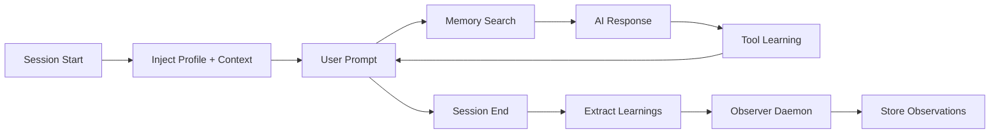

## What is CEMS?

CEMS (Continuous Evolving Memory System) gives AI coding assistants **persistent memory** across sessions. Instead of starting from scratch every time, your AI assistant remembers your preferences, project conventions, past decisions, and learned patterns.

<CardGroup cols={2}>
  <Card title="Quick Start" icon="rocket" href="/quickstart">
    Get from zero to working CEMS in 5 minutes
  </Card>
  <Card title="Installation" icon="download" href="/installation">
    All installation methods and configuration options
  </Card>
  <Card title="Server Deployment" icon="server" href="/deployment/overview">
    Deploy CEMS server for team usage
  </Card>
  <Card title="API Reference" icon="code" href="/api-reference">
    Complete API and CLI documentation
  </Card>
</CardGroup>

## Key Features

<CardGroup cols={3}>
  <Card title="Semantic Search" icon="magnifying-glass">
    Find memories using natural language, not just keywords. Powered by pgvector and embeddings.
  </Card>
  <Card title="Project-Scoped" icon="folder-tree">
    Memories automatically boost relevance for the project they were created in.
  </Card>
  <Card title="Multi-IDE Support" icon="window">
    Works with Claude Code, Cursor, Codex, Goose, and any MCP-compatible agent.
  </Card>
  <Card title="Auto-Learning" icon="brain">
    Session end hooks extract learnings automatically. Observer daemon watches transcripts.
  </Card>
  <Card title="Scheduled Maintenance" icon="calendar-clock">
    Nightly consolidation, weekly summarization, monthly re-indexing — all automatic.
  </Card>
  <Card title="Team Memory" icon="users">
    Share conventions and decisions with your team using shared memory scope.
  </Card>
</CardGroup>

## How It Works

CEMS integrates into your IDE workflow through hooks and MCP tools:



### Memory Lifecycle

1. **Memory Injection** — On every prompt, relevant memories are searched and injected as context
2. **Session Learning** — On session end, learnings are extracted and stored
3. **Observational Memory** — The observer daemon watches session transcripts and extracts high-level observations
4. **Scheduled Maintenance** — Nightly/weekly/monthly jobs deduplicate, compress, and prune memories automatically

## Architecture Highlights

<AccordionGroup>
  <Accordion title="Storage: PostgreSQL + pgvector">
    Everything lives in PostgreSQL with pgvector extension:
    - **`memory_documents`** — Documents with user/team scoping, categories, tags
    - **`memory_chunks`** — Chunked content with 1536-dim vector embeddings (HNSW index)
    - **`users` / `teams`** — Authentication via bcrypt-hashed API keys
  </Accordion>

  <Accordion title="Search Pipeline: Multi-Stage Retrieval">
    CEMS uses a sophisticated retrieval pipeline:
    1. **Query Understanding** — LLM routes to vector or hybrid strategy
    2. **Query Synthesis** — Expands query into 2-5 search terms
    3. **HyDE** — Generates hypothetical ideal answer
    4. **Candidate Retrieval** — pgvector HNSW + tsvector BM25
    5. **RRF Fusion** — Reciprocal Rank Fusion combines results
    6. **Relevance Filtering** — Removes low-confidence results
    7. **Scoring** — Time decay, priority boost, project-scoped boost
    8. **Assembly** — Greedy selection within token budget

    Search modes: `vector` (fast, 0 LLM calls), `hybrid` (thorough, 3-4 LLM calls), `auto` (smart routing).
  </Accordion>

  <Accordion title="Embeddings: text-embedding-3-small via OpenRouter">
    - 1536 dimensions
    - Batch support for bulk operations
    - Configurable backend (OpenRouter by default)
  </Accordion>

  <Accordion title="Observer Daemon: Workflow Learning">
    The `cems-observer` background process:
    - Polls `~/.claude/projects/*/` JSONL transcript files every 30 seconds
    - Sends 50KB chunks to server for observation extraction
    - Server uses Gemini 2.5 Flash to extract high-level patterns
    - Examples: "User deploys via Coolify", "Project uses PostgreSQL"
  </Accordion>
</AccordionGroup>

## Performance

<CardGroup cols={2}>
  <Card title="Recall@5: 98%" icon="chart-line">
    98% of relevant memories appear in top 5 results
  </Card>
  <Card title="Search Speed" icon="gauge-high">
    Vector search: &lt;50ms | Hybrid search: &lt;2s
  </Card>
</CardGroup>

## Compatibility

<Tabs>
  <Tab title="Claude Code">
    **Full integration** with 6 hooks, 6 skills, 2 commands:
    - Session start: profile + context injection
    - User prompt: memory search + observations
    - Tool use: pre/post hooks for learning and gate rules
    - Session end: learning extraction + observer start
    - Pre-compaction: context preservation
  </Tab>
  <Tab title="Cursor">
    **MCP + hooks** with 3 hooks, 5 skills:
    - Session start: profile injection
    - Agent response hook
    - Session end: learning extraction
    - MCP tools: search, add, forget, share, status
  </Tab>
  <Tab title="Codex">
    **MCP + commands** with 3 commands, 2 skills:
    - Commands: recall, remember, foundation
    - Skills: recall, remember
    - MCP server config in `config.toml`
  </Tab>
  <Tab title="Goose">
    **MCP extension** in `config.yaml`:
    - Full MCP tool access
    - Memory search, add, forget, update
  </Tab>
  <Tab title="Any MCP Agent">
    Works with **any MCP-compatible agent**:
    - 6 MCP tools exposed on port 8766
    - Streamable HTTP transport
    - Full CRUD operations on memories
  </Tab>
</Tabs>

## Use Cases

<Steps>
  <Step title="Personal Preferences">
    Store coding style, editor settings, workflow preferences:
    ```bash
    /remember I prefer Python with type hints and Pydantic for data validation
    /remember I use pytest with fixtures for all tests
    ```
  </Step>
  <Step title="Project Conventions">
    Document architecture decisions, naming conventions, patterns:
    ```bash
    /remember This project uses snake_case for database columns
    /remember API endpoints follow REST conventions with /api/v1/...
    ```
  </Step>
  <Step title="Team Knowledge">
    Share conventions across the team:
    ```bash
    /share We use PostgreSQL for primary database, Redis for caching
    /share All PRs require 2 approvals and passing CI
    ```
  </Step>
  <Step title="Session Context">
    Automatic learning from your workflow:
    - Successful patterns are extracted at session end
    - Observer daemon captures high-level workflows
    - Maintenance jobs consolidate and compress over time
  </Step>
</Steps>

## Next Steps

<CardGroup cols={2}>
  <Card title="Get Started" icon="play" href="/quickstart">
    Install CEMS client and create your first memory
  </Card>
  <Card title="Deploy Server" icon="server" href="/deployment/overview">
    Set up CEMS server for your team
  </Card>
</CardGroup>
